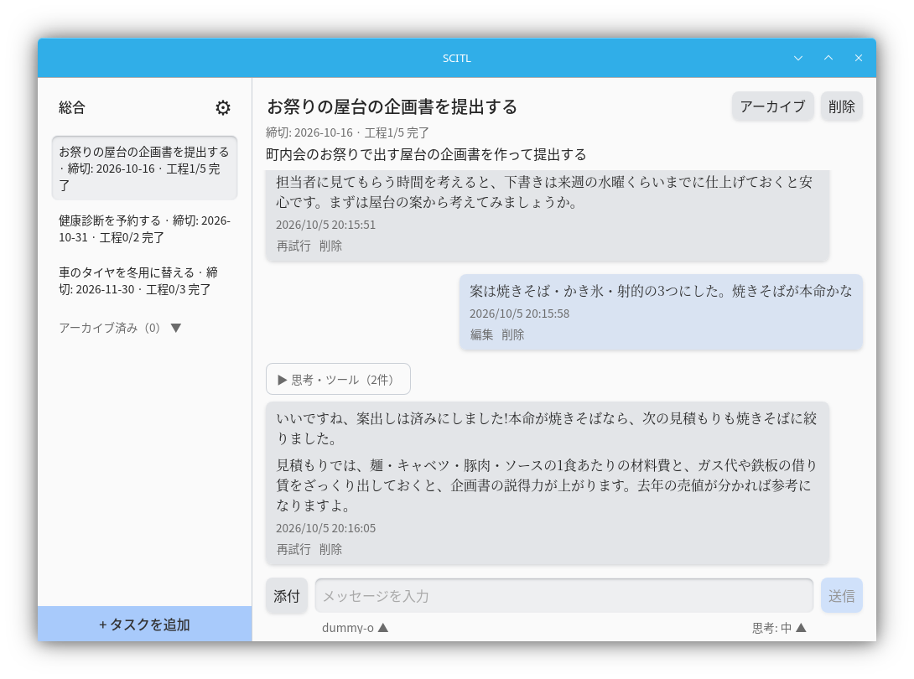

<!--
草案(Issue #253)。Claudeが下書きしたもの。確認が要る箇所は「TODO」のコメントで示す。
-->

# SCITL Task Companion

チャットでタスクの内容・締切を聞き取り、進捗の報告もチャットで行うタスク管理アプリです。
SCITLは **S**tandalone **C**hat **I**nterface for **T**asks with **L**Ms の略です。



## 特徴

- **チャットが操作の中心**: 専用の入力フォームではなく、会話を通してタスクを登録・更新します。
  全体を見渡す「総合チャット」と、個別のタスクに紐づく「タスクチャット」があります
- **ローカル完結**: サーバーを立てず単体で動きます。通信するのは、利用者が登録したLLM APIと
  外部ツールサーバー(MCP)だけです
- **LLMを選ばない**: OpenAI互換・Anthropic・Geminiの各形式のAPIに対応します。llama.cpp・
  LM Studio・Ollama等のローカル推論サーバーもOpenAI互換として使えます
- **外部ツール(MCP)**: Streamable HTTPのMCPサーバーを登録し、ツールをモデルに使わせられます
- **持ち運べる**: データは実行ファイルと同じフォルダに置くので、フォルダごと別のマシンへ移せます。
  Markdownへの書き出しもできます
- **秘密情報はOSの資格情報ストアへ**: APIキー等は設定ファイルに書かず、OSの資格情報ストアに保存します
- 表示言語は日本語・英語

## 対応OS

| OS | 状況 |
|---|---|
| Linux(x64) | 対応。Secret Service(GNOME Keyring・KWallet等)が動いている必要があります |
| Windows(x64) | 対応。APIキーは資格情報マネージャーに保存します |
| macOS | 非対応。秘密情報の保存先を用意していません |

Linuxで動作を確かめているのはKubuntu 26.04(KDE Plasma 6・Wayland、資格情報ストアはKWallet)です。
配布物はglibc 2.39以上(アプリ。CLIは2.34以上)を求めます。Ubuntu 24.04・Debian 13・Fedora 40より
古いディストリビューションでは起動しません。

## 使い始める

### 入れる

[GitHub Releases](https://github.com/Hue-215/SCITL/releases)から、OSに合った配布物
(`scitl-<版>-linux-x64.tar.gz`・`scitl-<版>-windows-x64.zip`)を取ってきて展開します。インストーラーは
ありません。中にはアプリ(`scitl` / `scitl.exe`)とCLI(`scitl-cli` / `scitl-cli.exe`)が入っています。

展開したフォルダは**ユーザーのフォルダの下**(Linuxは`~/`、Windowsは`C:\Users\<名前>\`の下など)に
置いてください。データはこのフォルダの中に作られます(次節)。アーカイブを展開せずに中から起動すると、
データが一時フォルダに置かれて消えるおそれがあるので、起動を断ります。

- **Linux**: WebKitGTK 4.1を入れておいてください(Ubuntu・Debianは`libwebkit2gtk-4.1-0`、Fedoraは
  `webkit2gtk4.1`)。無いと、ライブラリが見つからないというエラーで起動しません
- **Windows**: WebView2ランタイムを使います(Windows 11には標準で入っています)

### データの置き場所

データは、実行ファイルと同じフォルダの`data`に置かれます。アプリとCLIは同じデータを開きます。

```
scitl-<版>-linux-x64/
├── scitl
├── scitl-cli
├── LICENSE
├── THIRD-PARTY-LICENSES/
└── data/
    ├── scitl.sqlite3   # タスクと会話
    ├── config.toml     # 設定
    ├── attachments/    # 添付ファイル
    └── export/         # Markdownの書き出し
```

- **APIキーは`data`に入りません**。OSの資格情報ストアに保存するので、フォルダを別のマシンへ移したときは、
  そのマシンでプロバイダーを登録し直してください(削除して登録)
- **別のアカウント・別のOS(WSL等)・別のマシンから、同じフォルダを同時に開かないでください**。
  設定を互いに上書きします。同じログインの中では2つ目のアプリは起動しないので心配ありません
  (CLIはアプリと同時に使えます)
- **同期するフォルダ(Dropbox・OneDrive等)やネットワークドライブの上に置かないでください**。
  データベースのロックが効かず、データが壊れることがあります
- Windowsでは、置いた場所の権限をそのまま引き継ぎます。`C:\`の直下などに置くと、同じマシンの
  ほかのアカウントから読めてしまいます。Linuxでは、`data`を持ち主だけが入れる権限で作ります

### 新しい版にする

配布物のフォルダ名には版が入っているので、新しい版を展開すると`data`の無いフォルダになり、
空のデータで起動します。次のどちらかで、これまでのデータを引き継いでください。

- 古いフォルダの`data`を、新しいフォルダへ移す
- 新しい版の実行ファイル(`scitl`・`scitl-cli`)で、古いフォルダの実行ファイルを上書きする

新しい版で開いたデータは、古い版では開けないことがあります。戻す可能性があるなら、先に`data`を
複製しておいてください。

### 最初の設定

1. サイドバーの歯車から設定を開き、「APIプロバイダー」でプロバイダーを追加します

   | API形式 | ベースURLの例 |
   |---|---|
   | OpenAI互換 | `https://api.openai.com/v1`、LM Studio `http://localhost:1234/v1`、Ollama `http://localhost:11434/v1`、llama.cpp `http://localhost:8080/v1` |
   | Anthropic | `https://api.anthropic.com`(`/v1`を含めない) |
   | Gemini | `https://generativelanguage.googleapis.com`(`/v1beta`を含めない) |

   APIキーはローカル推論サーバー等では省略できます。`http://`で登録できるのは、`localhost`と
   プライベートIPアドレス(`192.168.x.x`等)を直接書いた場合だけです。それ以外は`https://`にしてください
2. 「モデル一覧を取得」から使うモデルを選んで追加します(モデル名を入力して追加することもできます)
3. チャットの入力欄の下でモデルを選びます

SCITLはタスクの読み書きをツール呼び出しで行うので、**ツール呼び出し(function calling)に対応した
モデル**を選んでください。

### 使い方

- **タスクを作る**: サイドバーの「タスクを追加」を押すと、モデルの方から話しかけてきます。
  やることや締切を答えると、モデルがタイトル・締切・工程を設定します
- **進捗を報告する**: そのタスクのチャットで「〇〇は終わった」のように伝えると、モデルが工程を
  済みにするなどして記録します
- **全体を相談する**: サイドバーの「総合」で、すべてのタスクを見渡した相談ができます。総合チャットは
  タスクを読むだけで、変更はタスクごとのチャットで行います
- **書き出す**: 設定の「一般」→「データの書き出し」で、タスクと会話をMarkdownに書き出せます

### 外部ツール(MCP)を使う

設定の「ツール/MCP」で、Streamable HTTPのMCPサーバーのURLを登録し、「ツール一覧を取得」から
モデルに使わせるツールを有効にします。有効にしたツールだけがモデルに見えます(サーバーが後から
ツールを増やしても、有効にするまでは見えません)。認証用のヘッダーの値は、APIキーと同じく
OSの資格情報ストアに保存します。

SCITLはサーバーをプロセスとして起動しない(stdio方式に対応しない)ので、stdioで動くMCPサーバーは、
stdioをHTTPへ中継するツールを自分で起動して使います。中継は次の2つを必ず守ってください。
ループバックでも認証が無いと、同じマシンのほかのアカウントや、ブラウザで開いた悪意のあるページ
(DNSリバインディング)からツールを呼ばれます。

- 待ち受けを`127.0.0.1`に限る
- 認証用のトークンを必須にし、その値をSCITLにヘッダーとして登録する

[supergateway](https://github.com/supercorp-ai/supergateway)での例です(トークンは推測されにくい値にしてください)。

```sh
npx -y supergateway \
  --stdio "npx -y @modelcontextprotocol/server-filesystem ~/notes" \
  --outputTransport streamableHttp \
  --host 127.0.0.1 --port 8000 \
  --apiKey "<トークン>"
```

SCITLには、URLに`http://127.0.0.1:8000/mcp`、ヘッダーに`Authorization=Bearer <トークン>`を登録します。

<!-- TODO: supergatewayの例をSCITLとつないで確かめる(フラグはsupergatewayのREADMEで確かめたが、SCITLからの接続は未確認) -->

### CLI

アプリを開かずにタスクを確認・操作できるCLI(`scitl-cli`)が、アプリと同じフォルダに入っています。
出力はJSONです。同じフォルダの`data`を開くので、先にアプリを一度起動してください。

```sh
./scitl-cli task list            # タスクの一覧(アーカイブ済みを含む)
./scitl-cli task show 1          # タスクの詳細
./scitl-cli chat show --task 1   # タスクチャットの発言(--task を省くと総合チャット)
./scitl-cli --data-dir DIR task list
```

Windowsでは`.\scitl-cli.exe task list`のように実行します。

ほかに`task rename`・`archive`・`unarchive`・`delete`があります(`--help`で一覧)。
外部のLLMツールにシェル経由で使わせることも想定しているため、応答の生成・設定の変更は持ちません。

## 開発

### 前提

- Rust 1.88以上(依存が求める最低の版。CIは最新のstableを使っています)
- Node.js 22
- Tauri 2のシステム依存([Tauriの案内](https://v2.tauri.app/start/prerequisites/))。
  Ubuntu 24.04では次のとおりです(CIの「システム依存を入れる」と同じ。`libdbus-1-dev`は資格情報ストアへの
  接続に使います)

  ```sh
  sudo apt install build-essential pkg-config libdbus-1-dev libwebkit2gtk-4.1-dev libgtk-3-dev \
    libayatana-appindicator3-dev librsvg2-dev libxdo-dev
  ```

  WindowsではMSVCのツールチェーン(Rustの既定)を使います

### 開発用に起動する

```sh
npm --prefix frontend ci
cd crates/scitl-tauri
npm ci
npm run tauri dev
```

フロントエンドの開発サーバー(Vite、`localhost:1420`)はTauri CLIが起動します。
データは`target/debug/data`に置かれます。CLIも`cargo run -p scitl-cli -- task list`のように
動かせば、同じデータを開きます。

開発者向けには、`scitl-cli`のコマンドに応答の生成・送信内容のプレビュー・設定・プロバイダーや
MCPサーバーの登録・Markdownの書き出し等を足した`scitl-debug-cli`があります。詳しくは
`docs/spec/architecture/cli.md`を見てください。

### テスト・lint

CIと同じものを手元で走らせられます(`.github/workflows/ci.yml`)。

```sh
cargo fmt --all --check
cargo clippy --workspace --all-targets --locked -- -D warnings
cargo test --workspace --locked

cd frontend
npm run typecheck
npm run lint
npm run build
```

**`frontend/src/bindings/`は`cargo test`が生成します。** Rust側の型から作るTypeScriptの型定義なので、
手で直さず、Rust側を変えたら`cargo test`で生成し直してコミットしてください。

### 配布物を作る

`npm run tauri build`や`cargo build --release`を直接使わず、次のスクリプトを使います。ビルドした人の
絶対パスをバイナリから外し、アプリ・CLI・第三者ライセンスの一覧を`target/dist/`にまとめます。

| OS | コマンド |
|---|---|
| Linux | `scripts/release-build.sh` |
| Windows | `pwsh scripts/release-build.ps1 --no-bundle`(PowerShell 7.2以降) |

上の前提に加えて、[cargo-about](https://github.com/EmbarkStudios/cargo-about)が要ります
(`cargo install cargo-about --locked --version 0.9.2 --features cli`)。仕組みと確かめ方は
`.claude/skills/release-build/SKILL.md`にあります。

## ドキュメント

設計の文書は`docs/spec/`にあります。まず索引の`docs/spec/index.md`を読み、触る領域の文書だけを
読む使い方を想定しています。

- `docs/spec/principles.md` — 実装が変わっても守る設計原則
- `docs/spec/architecture/` — 領域ごとの方針(LLMとの通信、秘密情報、WebViewとの境界など)
- `docs/spec/data-model/` — データベースの形
- `docs/spec/tools.md` — モデルに公開するツール
- `docs/spec/ui.md` — 画面

## 開発の進め方

- 不具合の報告・要望は[GitHub Issues](https://github.com/Hue-215/SCITL/issues)で受け付けています。
  今のところ、外部からのPRは受け付けていません
- ブランチはGit Flow(`main` / `develop` / `feature/*` / `release/*` / `hotfix/*`)で、
  `develop`から`feature/*`を切ってPRで取り込みます
- `CLAUDE.md`・`.claude/skills/`はClaude Code向けの運用の決まりです

## セキュリティ

脆弱性は公開のIssueではなく、非公開の報告機能から知らせてください。詳しくは[SECURITY.md](SECURITY.md)を
見てください。

## ライセンス

[MIT License](LICENSE)

配布物には、同梱した依存のライセンスの一覧を`THIRD-PARTY-LICENSES/`として入れています。
