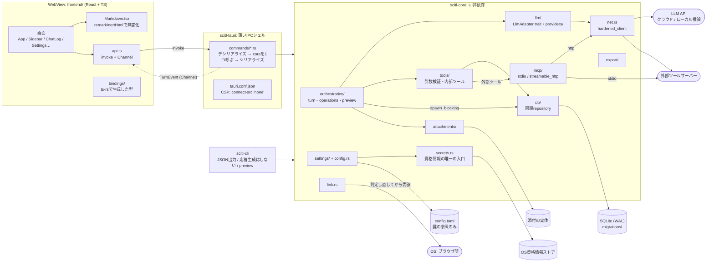
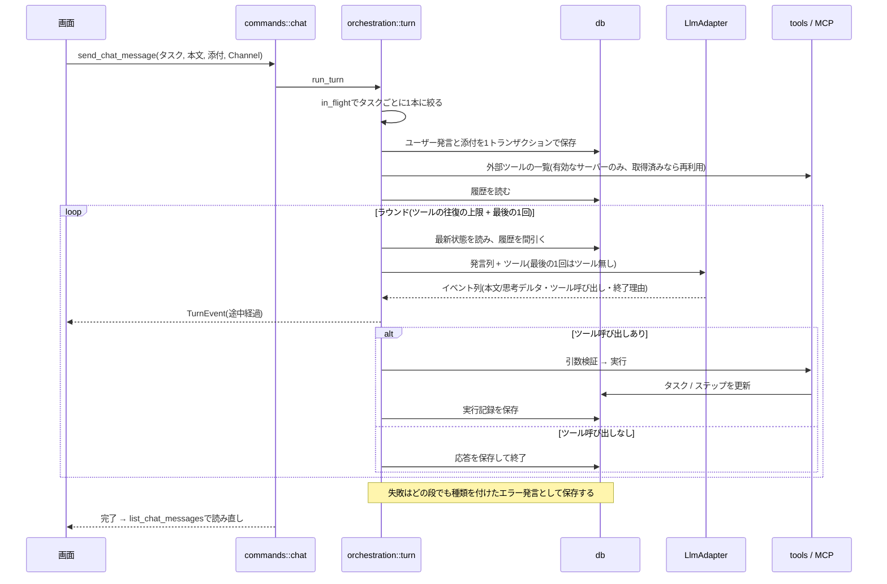
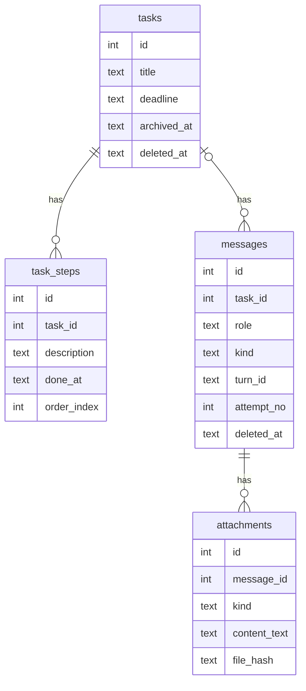

# アーキテクチャの概観図

全体を読み通さずに構成を掴むための地図。方針と理由は`spec/rebuild/architecture.md`、
スキーマは`spec/rebuild/data-model.md`が正本であり、図と食い違う場合は常にそちらとコードを
正とする。図にはそれらに無い判断を書かない。

モジュールの分け方・プロセス境界・1ターンの処理の順番・テーブルの関係が変わったときに更新する。

## 1. 全体構成(プロセス境界とモジュール)

WebViewは表示に徹し、秘密情報・外部通信・データベースへの経路はすべて`scitl-core`を通る
(`architecture.md` 1節・5節・6節・7節)。

## 2. 1ターンの流れ(チャット送信)

`orchestration::turn`の`run_turn`から`run_tool_rounds`まで。履歴は最初に1度だけ読み、
最新状態と間引きはラウンドごとにやり直す(`architecture.md` 3節、`tools.md` 4節)。

## 3. データモデル

論理削除(`deleted_at`)と、発言が属するターン(`turn_id`・`attempt_no`)の意味は
`data-model.md`を参照。

